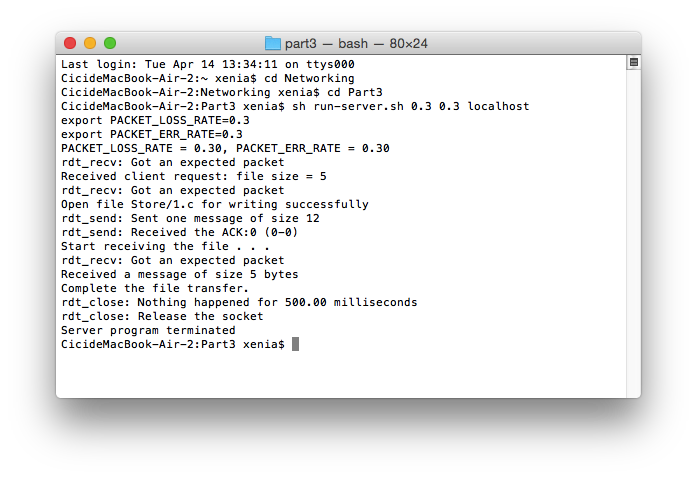
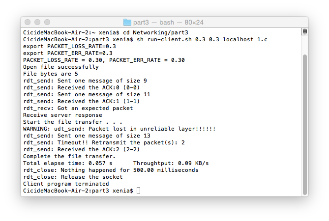

### Reliable-Data-Transfer-3.0-Protocol-Networking
Project of COMP 3234, Computer and Communication Networks  

C++ design and implementation of a reliable data transfer layer using a modified version of Stop-and-Wait (rdt 3.0) protocol. The RDT layer supports connectionless reliable duplex data transfer on top of unreliable UDP.   

For detailed description, please refer to Project Specification.pdf.  

